### PC1

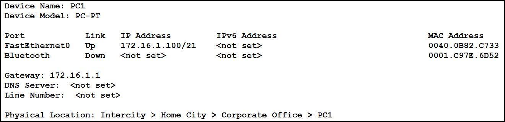

### PC2

### PC3

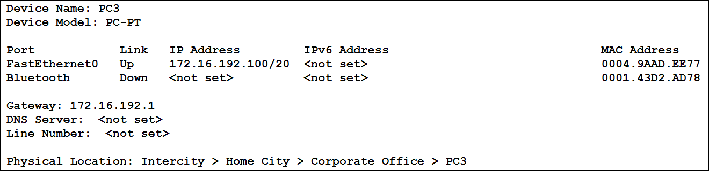

### PC4

### PC5

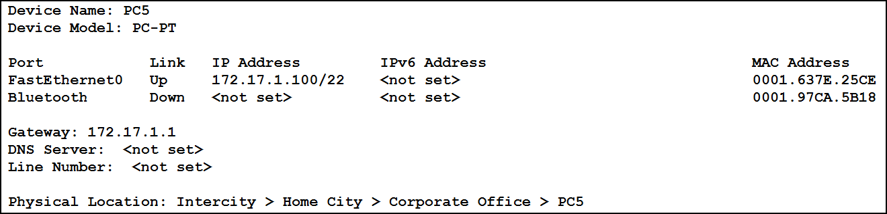

### PC6

### PC7

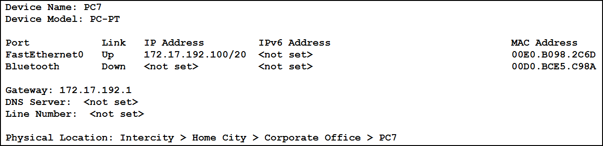

### PC8

### 三层交换机建立vlan

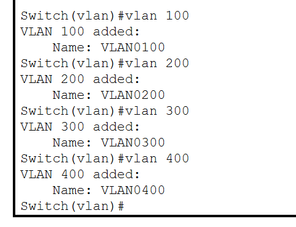

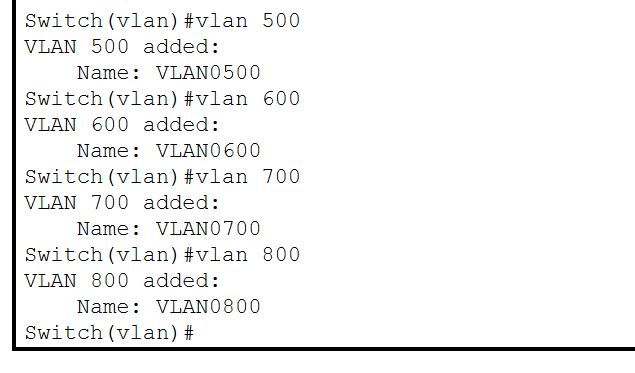

### 配置vlan的IP地址

#### switch0

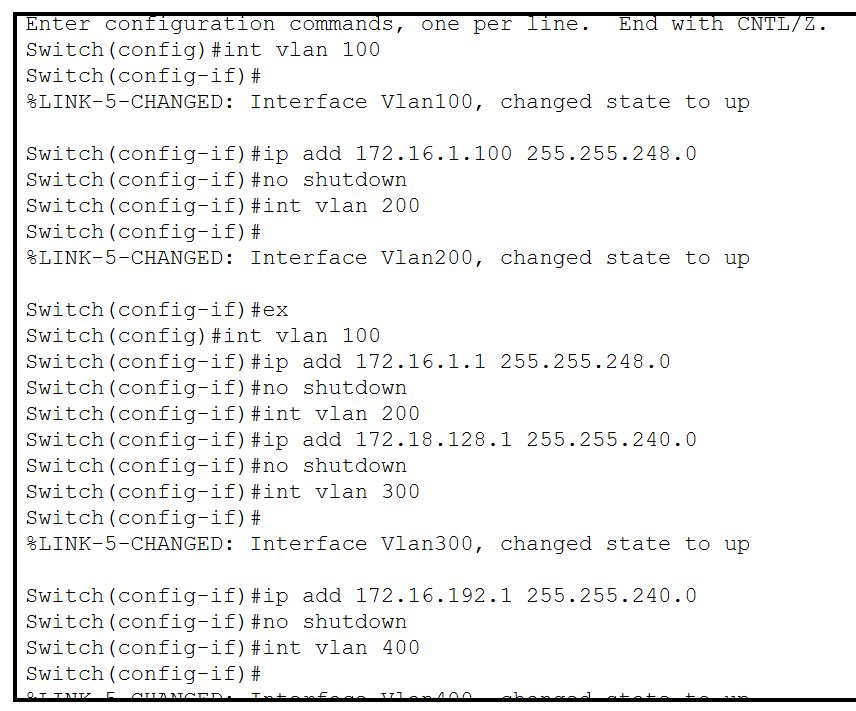

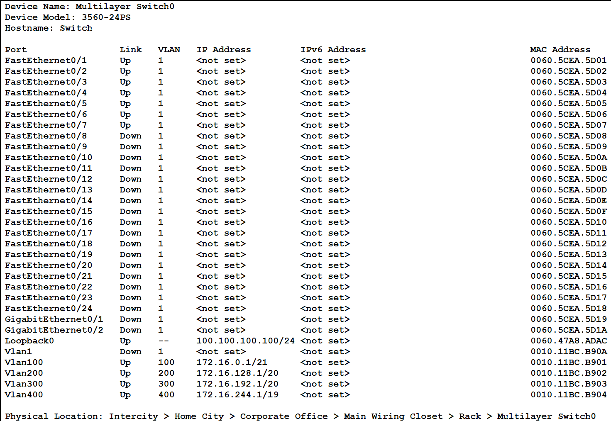

#### switch1

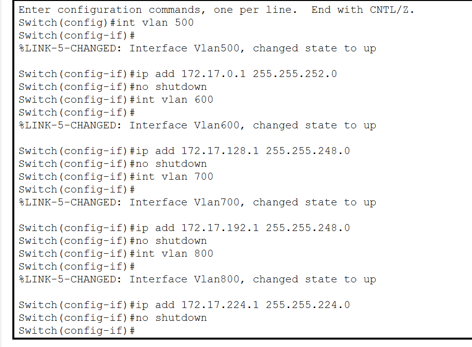

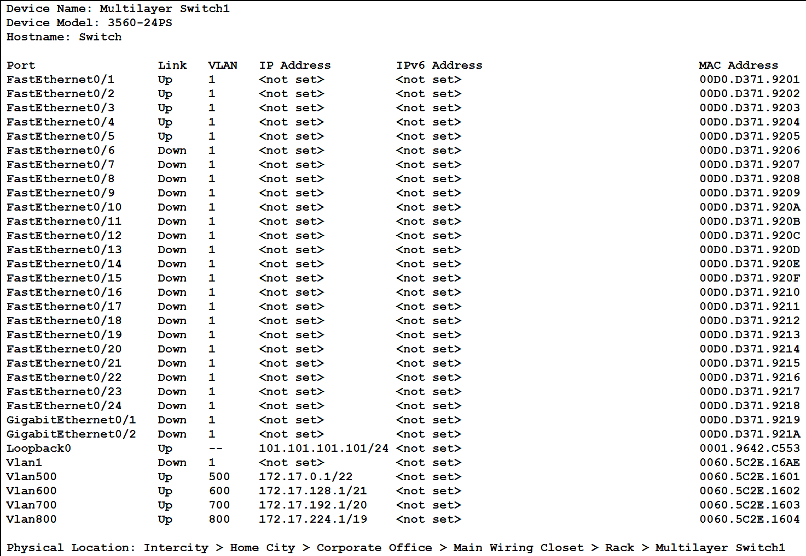

### 三层交换机配置路由vlan连通

#### switch0

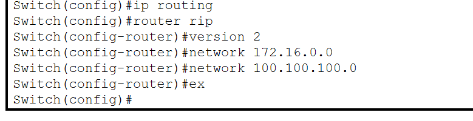

#### switch1

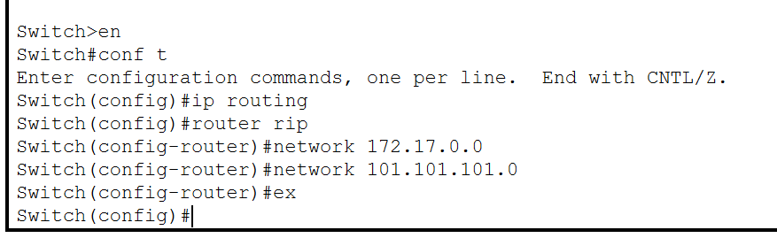

### 三层交换机封装trunk

#### switch0

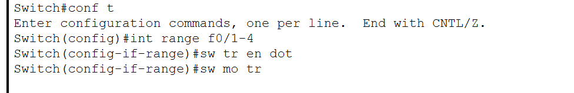

#### switch1

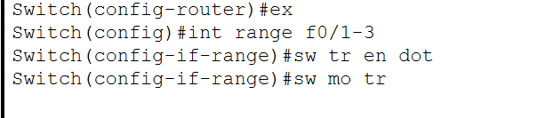

### 配置二层交换机

### 配置路由协议

#### Router0

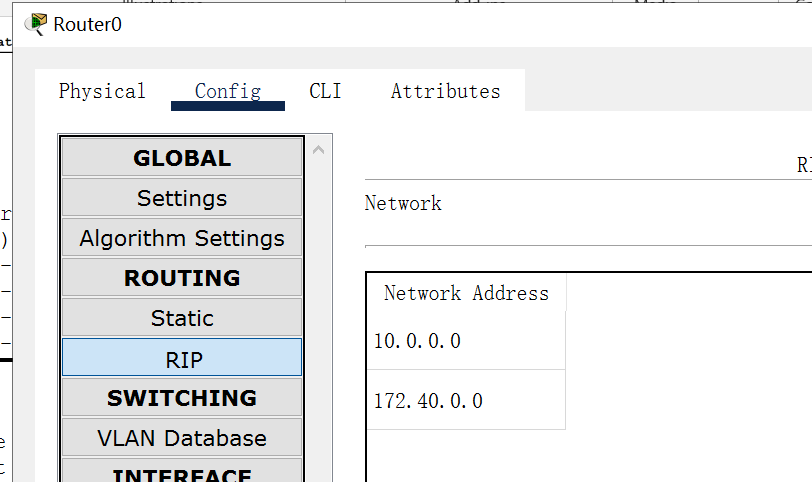

#### Router1

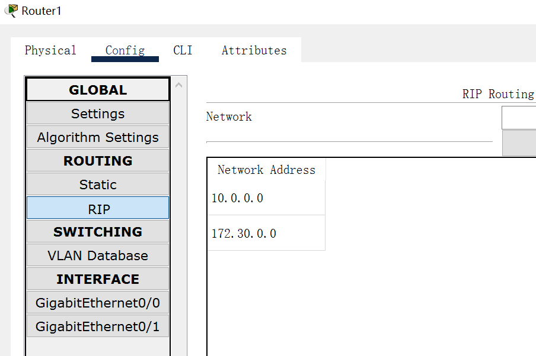

### 配置三层交换机和服务器的接口IP

#### switch0

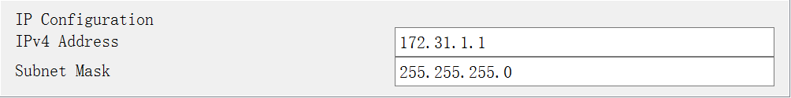

#### Switch1

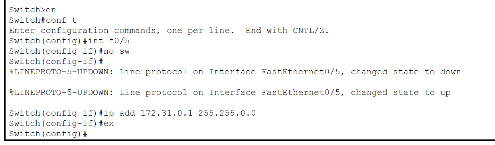

### 配置服务器

#### 老校区DNS

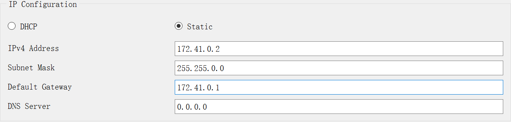

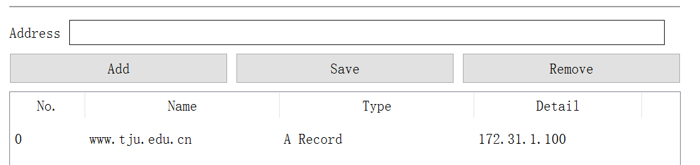

#### 新校区DNS

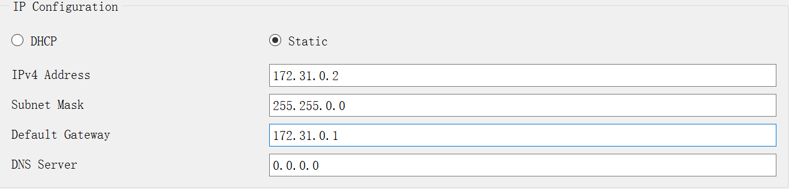

#### 老校区HTTP

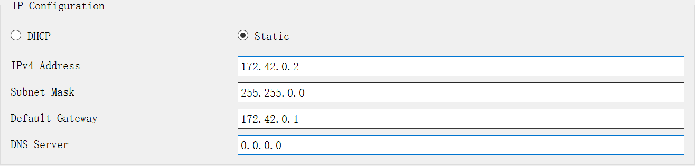

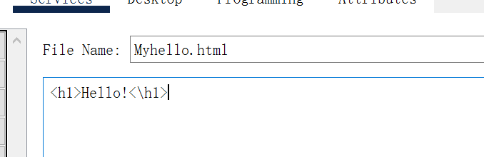

#### 老校区PC添加DNS服务器

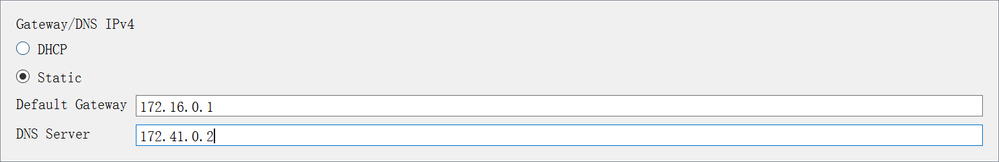

#### 新校区PC添加DNS服务器

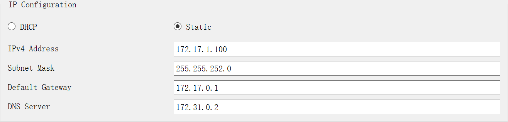

